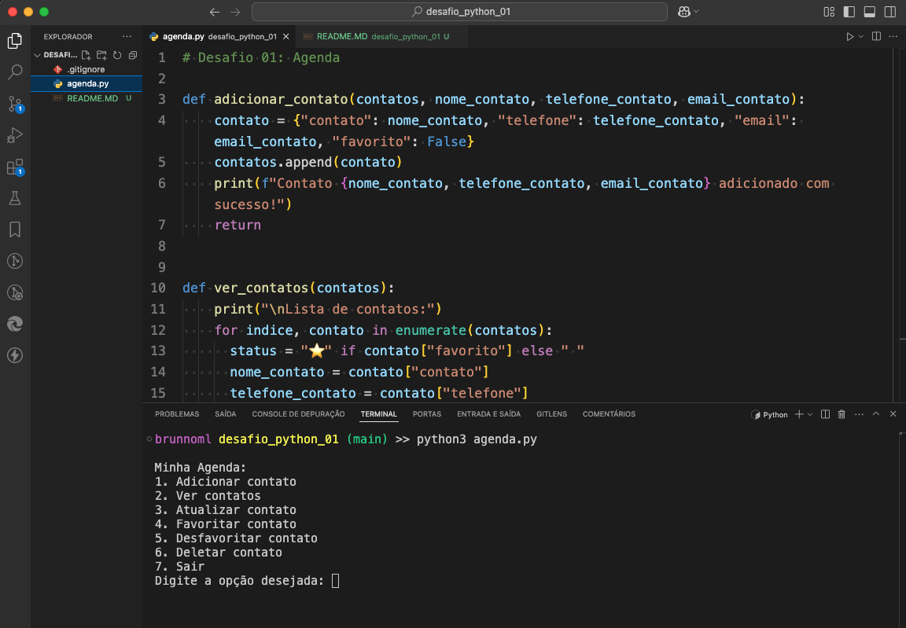

<h1 align="center"> Curso de Python da Rocketseat</h1>
<h2 align="center"> Desafio 01 - AGENDA</h2>

Desafio referente ao módulo: Introdução ao Python.  

  <a href="#-tecnologias">Tecnologias</a>&nbsp;&nbsp;&nbsp;|&nbsp;&nbsp;&nbsp;
  <a href="#-projeto">Projeto</a>&nbsp;&nbsp;&nbsp;|&nbsp;&nbsp;&nbsp;
  <a href="#memo-licença">Licença</a>

  

 

  

## 🚀 Tecnologias

Esse desafio foi desenvolvido com as seguintes tecnologias:

- Python
- Git e Github

## 💻 Projeto

* O projeto é a resolução do `Desafio 01` do curso de Python da Rocketseat, utilizando os conceitos adquiridos durante o módulo de introdução ao Python, objetivando desenvolver uma agenda para salvar, editar, deletar e marcar/desmarcar um contato como favorito.

* O resultado da aplicação deve ser apresentado no terminal, iniciando mostrando uma lista de opções do que é possível fazer com o app e permitir que o usuário digite uma escolha para iniciar a aplicação.

## :memo: Licença

Esse projeto está sob a licença MIT.

---

Feito com ☕️  por [BrunnoML](https://www.brunnoml.com.br)
